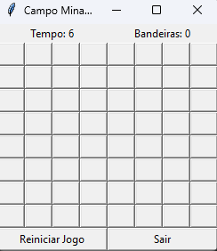
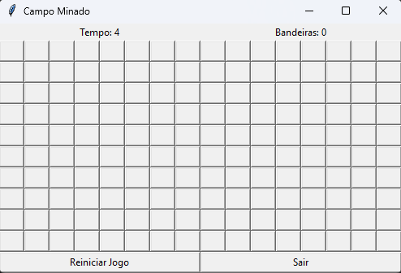
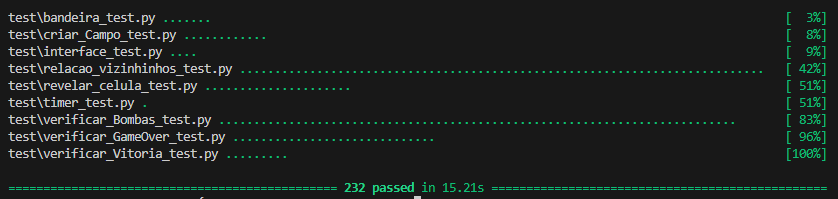
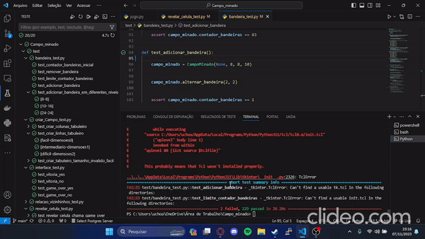

###

O que faltou                       | O que foi feito
-----------------------------------|---------------------------------
❌ Tecnicas utilizadas            | ✅ Tecnicas utilizadas          
❌ Agrupar                        | ✅ Agrupar
❌ Descrição do uso das tecnicas  | ✅ Descrição do uso das tecnicas
❌ requisitos = 30                | ✅ Requisitos = 40
❌ Gradle                         | ❌ Gradle 


<h1> ✅ </h1> 

## Aqui voce  encontra as  alterações

 - [Tecnicas Utilizadas](./Tecnicas_Utilizadas.md)
 - [Requisitos e casos de testes](./requisitos.md)
 - [Agrupamento - Testes separados por tecnicas](./testes_por_tecnica.md)


Bem, tentei adicionar o build com gradle, mas não consegui a então as únicas alterações que fiz foi na documentação em relação às técnicas e a requisitos que já tinha no meu projeto, mas como eu não tava com muito tempo acabei esquecendo de colocar na primeira entrega.    

# Campo minado

## Tópicos

- [Apresentando o jogo](#apresentando-o-jogo)


- [Como rodar o projeto?](#como-rodar-o-projeto)

- [Como consigo executar  os testes?](#como-executar-os-testes)

- [Quantidade de testes](#quantidade-de-testes)

- [Requisitos e casos de testes](./requisitos.md)

- [Tecnicas Utilizadas](./Tecnicas_Utilizadas.md)

- [Testes Rodando](#testes-rodando)


## Apresentando o jogo


### Jogo fácil



### Jogo intermediário



### Jogo Difícil


</p>


## Como rodar o Projeto?


### Entre na raiz do projeto 

```sh
cd campo-minado
```

### Instale todas as dependências

```sh
pip3 install -r dependencias.txt
```

### Execute o jogo já compilado

```sh
pip3 main.py
```

## Como executar os testes?

### Dentro do diretório do projeto (caminho/campo-minado) execute

```sh
pip3 -m pytest ./test
```

## Quantidade de Testes
- obs: o pytest algumas vezes buga com a interface mas todos teste estão corretos como mostra na imagem



## Testes Rodando


