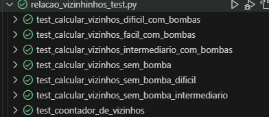
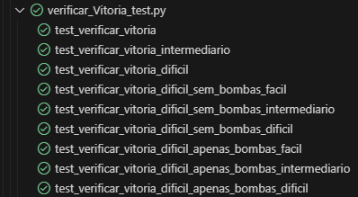

# Campo_minado

# Requisitos

## R1: Inicialização do Jogo
O jogo deve ser inicializado com um tabuleiro em três dimensões:
- R1.1 - Fácil (8x8)
- R1.2 - Intermediário (8x8)
- R1.3 - Difícil (8x8)

### Testes
- Teste: Criar tabuleiro nas dimensões corretas
- Teste: Criar tabuleiro tamanho inválido

O número de bombas no tabuleiro também deve ser configurável.
- Fácil: 10 bombas
- Intermediário: 30 bombas
- Difícil: 100 bombas

## R2: Geração Aleatória de Bombas
- O jogo deve gerar bombas aleatoriamente no tabuleiro no início de cada partida.

- O número de bombas geradas deve corresponder ao número configurado.

## R4: Revelação de Células
- O jogador pode clicar em uma célula para revelar seu conteúdo.

- Se a célula contiver uma bomba, o jogo deve terminar, e o jogador perde.

## R5: Contagem de Bombas Vizinhas
 - O jogo deve calcular e exibir a quantidade de bombas vizinhas a cada célula não contendo uma bomba.

## R6: Vitória
 - O jogador vence o jogo quando todas as células seguras forem reveladas.

## R7: Reiniciar o Jogo
 - O jogo deve permitir ao jogador reiniciar a partida após vitória ou derrota.

## R8: Contagem de Tempo
- O jogo deve contar o tempo desde o início da partida até a sua conclusão (vitória ou derrota).

## R9: Bandeiras
- O jogador pode colocar bandeiras em células para indicar onde acredita que há bombas.

## R10: Remover Bandeiras
- O jogador pode remover bandeiras.

## R10: Atualização da Contagem de Bombas
- A contagem de bombas vizinhas deve ser atualizada após a revelação de células.

## R11: Revelação Automática de Áreas Vazias
- Se o jogador revelar uma célula vazia, todas as células vizinhas também devem ser reveladas automaticamente até encontrar células com contagem de bombas vizinhas.

## R12: Finalização do Jogo ao Clicar em Bomba
- Se o jogador clicar em uma célula contendo uma bomba, o jogo deve finalizar e mostrar todas as bombas no tabuleiro.

## R13: Opção de Reiniciar Durante o Jogo
- O jogador deve ter a opção de reiniciar o jogo a qualquer momento durante a partida.

## R14: Opção de Sair do Jogo
- O jogador deve ter a opção de sair do jogo a qualquer momento.

## R15: Mensagem de Vitória
- Quando o jogador vence o jogo, uma mensagem de vitória deve ser exibida.

## R16: Mensagem de Derrota
- Quando o jogador perde o jogo, uma mensagem de derrota deve ser exibida.

## R17: Derrota ao Revelar Bomba
- O jogo deve verificar se uma célula com uma bomba foi revelada, encerrando a partida e exibindo uma mensagem de derrota.

# Interface

## R18: Seleção de Nível de Dificuldade
- O jogador deve ser capaz de escolher o nível de dificuldade entre Fácil, Intermediário e Difícil.

- Os níveis de dificuldade são definidos por diferentes dimensões do tabuleiro e números de bombas.

## R19: Início de um Novo Jogo
- Ao selecionar um nível de dificuldade, um novo jogo deve ser iniciado com base nas dimensões e bombas correspondentes ao nível selecionado.

## R20: Finalização de um Jogo
- O jogador deve ter a opção de sair do jogo durante uma partida em andamento.
- Ao confirmar a saída, a aplicação deve ser fechada.

## R21: Visualização das Bombas
- Após uma derrota, o jogo deve exibir a localização de todas as bombas no tabuleiro.

## R22: Revelar célula com botão esquerdo
- O usuario dever revelar as celulas com botão direito
## R23: Adicionar e remover bandeira com botão direito
- Deve ser possivel adicionar e remover bandeira com botão direito

  
 

# Testes
 ## Total  
 

## 1. Criação de Campo

## 2. Relação de Vizinhança

## 3. Bandeira

## 4. Verificações de Bomba

## 5. Game Over

## 6. Vitória

## 7. Revelar Célula

