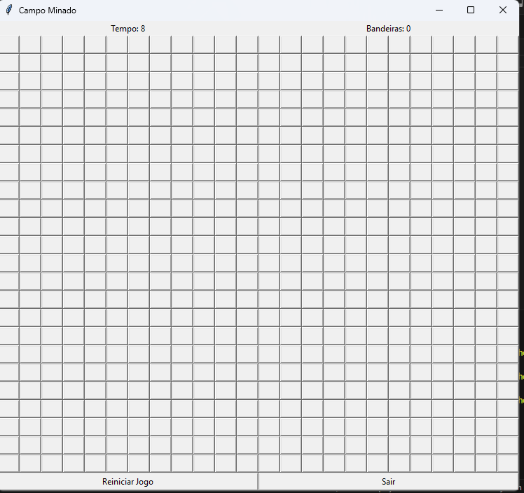

# Campo minado

## Tópicos

- [Apresentando o jogo](#apresentando-o-jogo)


- [Como rodar o projeto?](#como-rodar-o-projeto)

- [Como consigo executar  os testes?](#como-executar-os-testes)

- [Qunatidade de testes](#quantidade-de-testes)

- [Requisitos e casos de testes](./requisitos.md)

- [Tecnicas](./Tecnicas.md)


## Apresentando o jogo


### Jogo fácil


### Jogo intermediário


### Jogo Difícil



</p>

## :hammer: Como Jogar

- `Funcionalidade 1`: O botão esquerdo do mouse serve para revelar células
- `Funcionalidade 2`: O botão direito do mouse serve para adicionar e remover bandeiras
- `Funcionalidade 3`: Antes de iniciar a partida, as informações de nível, número de bombas e bandeiras é apresentada

## Como rodar o Projeto?


### Entre na raiz do projeto 

```sh
cd campo-minado
```

### Instale todas as dependências

```sh
pip3 install -r dependencias.txt
```

### Execute o jogo já compilado

```sh
py main.py
```

## Como executar os testes?

### Dentro do diretório do projeto (caminho/campo-minado) execute

```sh
py -m pytest ./test
```

## Quantidade de Testes
- obs: o pytest algumas vezes buga com a interface mas todos teste estão corretos como mostra na imagem


